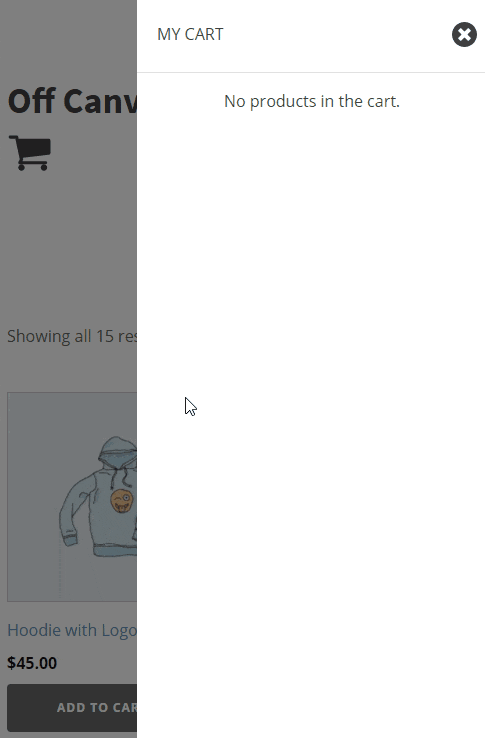
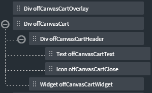

# Off-Canvas Cart for Woocommerce



## Tutorial
1. Structure
	* Add Div and give it a class with the name `off-canvas-cart-overlay`
    * Add Div and give it a class with the name `off-canvas-cart`
        * Inside this Div (`off-canvas-cart`), Add another Div and give it a class `off-canvas-cart-header`  
            * Inside this Div (`off-canvas-cart-header`), Add Text and give it a class `off-canvas-cart-text`  
            * Inside this Div (`off-canvas-cart-header`), Add Icon and give it a class `off-canvas-cart-close`  

        * Inside this Div (`off-canvas-cart`), Add → WordPress → Widgets → Cart and give it a class `off-canvas-cart-widget`
            * Remove the Cart Title
			
	In the end it should look like this,  
	
		
2. Create a Code Block or a Stylesheet and then add the following css:
	```css
	.off-canvas-cart {
		height: 100vh;
		width: 350px;
		
		position: fixed;
		right: 0;
		top: 0;
		
		z-index: 999;
		background-color: white;
		
		-webkit-transition: all 0.3s ease;
		transition: all 0.3s ease;
		transform: translate(100%,0);
	}

	.cart-active {
		transform: none;
	}

	.overflow-hidden {
		overflow: hidden;
	}

	.off-canvas-cart-overlay {
		position: fixed;
		left: 0;
		right: 0;
		top: 0;
		bottom: 0;
		
		z-index: 998;
		background: rgba(0,0,0,.5);
		
		opacity: 0;
		visibility: hidden;
	}

	.overlay-active {
		opacity: 1;
		visibility: visible;
	}

	.off-canvas-cart-header {
		display: flex;
		flex-direction: row;
		justify-content: space-between;
		align-items: center;
		width: 100%;
		
		border-bottom-style: solid;
		border-bottom-width: 1px;
		border-bottom-color: #e2e2e2;
	}

	.off-canvas-cart-text {
		padding: 20px;
	}

	.off-canvas-cart-close {
		margin: 10px;
		width: 25px;
	}

	.off-canvas-cart-widget {
		height: 100%;
	}

	.widget.woocommerce.widget_shopping_cart {
		height: 100%;
		width: 100%;
	}

	.widget .widget_shopping_cart_content {
		height: 100%;
		width: 100%;
		display: flex;
		flex-direction: column;
	}

	.woocommerce .widget_shopping_cart_content ul.product_list_widget {
		flex-grow: 1;
		overflow-y: auto;
		overflow-x: hidden;
		scroll-snap-type: y mandatory;
	}

	.off-canvas-cart-widget li.mini_cart_item.woocommerce-mini-cart-item {
		margin-top: 5px;
	}

	/* Product Title */
	.woocommerce .widget_shopping_cart_content ul.product_list_widget li a {
		color: #272728;
		font-size: 13px;
		font-weight: 400;
		line-height: 1.7;
		text-transform: uppercase;
		overflow-wrap: break-word;
	}

	/* Product Quantity */
	.off-canvas-cart-widget .woocommerce-mini-cart .woocommerce-mini-cart-item .quantity {
		font-size: 13px;
	}

	/* Product Price */
	.off-canvas-cart-widget .woocommerce-Price-amount.amount {
		color: #ff4000;
		font-size: 13px;
	}

	/* Product Delete Cross */
	.off-canvas-cart-widget .widget_shopping_cart_content .cart_list li a.remove {
		background-color: #EFEFEF;
		width: 15px;
		height: 15px;
		line-height: 15px;
		font-size: 14px;
		color: #FF0000 !important;
		margin-right: 10px;
		margin-top: 4px;
	}

	.off-canvas-cart-widget .woocommerce-mini-cart__buttons {
		flex-direction: unset;
		margin: 0;
	}

	.off-canvas-cart-widget .woocommerce.widget_shopping_cart .buttons a {
		border: none;
		border-radius: 0px;
		background-color: #666666;
		color: white;
		margin: 0;
	}

	/* Subtotal */
	.off-canvas-cart-widget .woocommerce.widget_shopping_cart .total {
		background-color: #f2f2f2;
		margin: 0px;
		padding: 15px;
		border-top: 1px solid #dedcdc;
	}

	/* Checkout Button */
	.off-canvas-cart-widget .widget_shopping_cart_content .buttons a.checkout {
		background-color: #ff8c5e;
	}

	/* Thumbnail */
	.off-canvas-cart-widget ul.product_list_widget li a img {
		width: 80px;
		margin-top: 5px;
		margin-bottom: 5px;
		margin-right: 15px;
		margin-left: 10px;
	}

	/* No products in the cart. */ 
	.woocommerce-mini-cart__empty-message {
		text-align: center;
	}
	```

3. Create a new cart Icon somewhere on the page and give it a class `off-canvas-cart-open`
4. Add the following JavaScript to the new Icon:
	```javascript
	jQuery(document).ready(function($) {
		$('.off-canvas-cart-open, .off-canvas-cart-overlay, .off-canvas-cart-close').click(function(){
			$('.off-canvas-cart-overlay').toggleClass('overlay-active');
			$('.off-canvas-cart').toggleClass('cart-active');
			$('body').toggleClass('overflow-hidden');
		});
	});
	```
