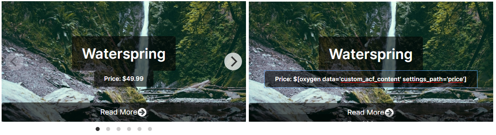

# Flickity Carousel
  

## Tutorial
1. Download the files from Flickity [here](https://flickity.metafizzy.co/) and 
enqueue JavaScript & CSS by following [Enqueue Scripts & CSS](enqueue-scripts-css.md)
2. Create a `Div` and: 
	- Set `class` → `main-carousel`
	- Set `width` → `100%`
	- Set `display` → `block`
	- Add `JavaScript` →
		```javascript
		var flkty = new Flickity( '.main-carousel', {
			// options
			cellAlign: 'left',
			contain: true
		});
		```
3. Create another `Div` inside the first `main-carousel`-`Div` and:
	- Set `class` → `carousel-cell`
	- Set `width` → `100%`
	- Set `height` → `300px`
4. Duplicate the `carousel-cell`-`Div` to create more slides.

One useful options is `wrapAround: true` for infinite scrolling.  
Several other options available [here](https://flickity.metafizzy.co/options.html)

## Repeater
Is is very easy to integrate Flickity with the Repeater element, almost the same as above.
1. Add a `Repeater` and:
	- Set `class` → `main-carousel`
	- Add `JavaScript` →
		```javascript
		var flkty = new Flickity( '.main-carousel', {
			// options
			cellAlign: 'left',
			contain: true
		});
		```
2. Set a query of your choice
3. Open the `Div` inside the `Repeater` and:
	- Set `class` → `carousel-cell`
4. Insert any element you like!

### Advanced Custom Field (ACF)
* Filter the Repeater-Query with your Custom Post Type
* Insert for example a text-element, Insert Data → Advanced Custom Field Options
 