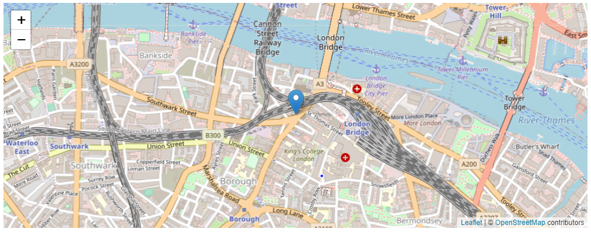
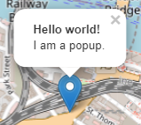
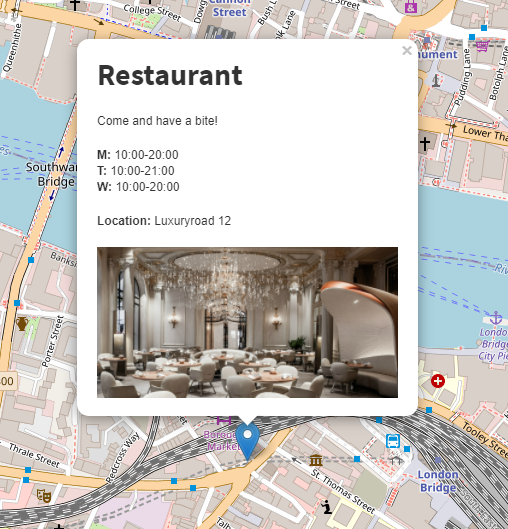
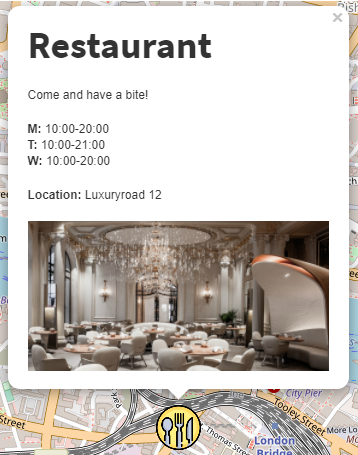

# Leaflet OpenStreetMap
  

## Tutorial
1. Download files from Leaflet [here](https://leafletjs.com/download.html) and 
enqueue JavaScript & CSS by following [Enqueue Scripts & CSS](enqueue-scripts-css.md)
2. Create a `Div` and:  
	- Set `id` → `map`
	- Set `width` → `100%`
	- Set `height` → `300px`
3. Go to `Div` → `JavaScript` and insert:  
```javascript
var latitude = 51.505;
var longitude = -0.09;
var zoom = 13;

// Initialize the map
var map = L.map('mapid').setView([latitude, longitude], zoom);

L.tileLayer('https://{s}.tile.openstreetmap.org/{z}/{x}/{y}.png', {
	attribution: '&copy; <a href="https://www.openstreetmap.org/copyright">OpenStreetMap</a> contributors'
}).addTo(map);
```


Add markers, circles and polygons
------
#### Marker
```javascript
var marker = L.marker([latitude, longitude]).addTo(map);
```

#### Circle
```javascript
var circle = L.circle([latitude, longitude], {
    color: 'red',
    fillColor: '#f03',
    fillOpacity: 0.5,
    radius: 500
}).addTo(map);
```

#### Polygon
```javascript
var polygon = L.polygon([
    [latitude_1, longitude_1],
    [latitude_2, longitude_2],
    [latitude_3, longitude_3]
]).addTo(map);
```

Add text to marker
------
  

```javascript
marker.bindPopup("<b>Hello world!</b><br>I am a popup.");
```
You can add `.openPopup();` if you want the text to immediately open on load.  
You can add any HTML-code so you can for e.g. insert images like this  

* Read more *[here](https://leafletjs.com/reference-1.7.1.html#popup)*

Markers with custom icons
------

```javascript
var customIcon = L.icon({
    iconUrl: 'https://someurl.com/image.png',
    iconSize: [45, 45]
});

var marker = L.marker([latitude, longitude], {icon: greenIcon}).addTo(map)
```
* Read more *[here](https://leafletjs.com/examples/custom-icons/)*

Events
------
```javascript
function onMapClick(e) {
    alert("You clicked the map at " + e.latlng);
}

map.on('click', onMapClick);
```
* Read more *[here](https://leafletjs.com/reference-1.7.1.html#map-event)*  

**Make sure to read OpenStreetMaps policy on tile-usage!**
------
#### **[Leaflet](https://leafletjs.com/)**  
* Find the docs *[here](https://leafletjs.com/reference-1.7.1.html)*  
* Find the FAQ *[here](https://github.com/Leaflet/Leaflet/blob/master/FAQ.md)*  

#### **[OpenStreetMap](https://www.openstreetmap.org/)**  
* Find the policy *[here](https://operations.osmfoundation.org/policies/tiles/)*  