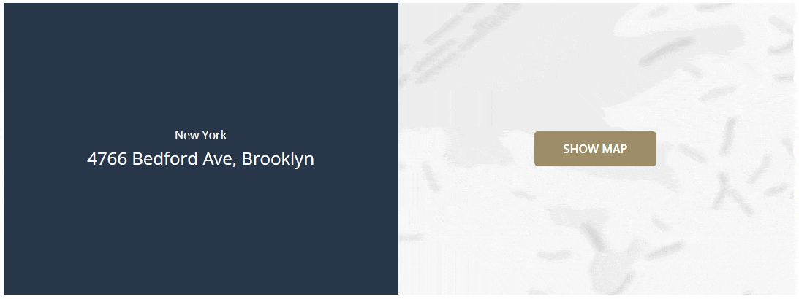

# Load Google Maps On Click
  

## Description
Instead of loading all the requests from Google Maps on page-load we will instead load the map when we click on it.

## Tutorial
1. `+ Add` → `Div` and add a class with the name `container`
2. Inisde the `container`-`Div`
	- `+ Add` → `Image` and add a class with the name `gmaps-placeholder`  
	- `+ Add` → `Text` and add a class with the name `gmaps-text`  
	- `+ Add` → `Code Block`  
	
3. Inside the `Code Block`

	**PHP & HTML**
	```HTML
	<iframe class="gmaps-frame" src="" style="border:0;" allowfullscreen="" loading="lazy"></iframe>
	```

	**JavaScript**
	```javascript
	jQuery( document ).ready(function($) {
		var url = "https://www.google.com/maps/embed?pb=!1m18!1m12!1m3!1d3030.0145666080375!2d-73.94640228459892!3d40.58543387934576!2m3!1f0!2f0!3f0!3m2!1i1024!2i768!4f13.1!3m3!1m2!1s0x89c2447b9a19ca47%3A0xdce3034eb1d6a183!2s4766%20Bedford%20Ave%2C%20Brooklyn%2C%20NY%2011235%2C%20USA!5e0!3m2!1ssv!2sse!4v1634670411997!5m2!1ssv!2sse"

		$('.gmaps-placeholder, .gmaps-text').on('click', function() {
			$('.gmaps-placeholder, .gmaps-text').fadeOut();
			$('.gmaps-frame').attr("src", url);
		});
	})
	```

	**CSS**
	```css
	.container {
		position: relative;
		width: 50%;
		height: 400px;
		
		display: flex;
		justify-content: center;
		align-items: center;
		
		cursor: pointer;
	}

	.gmaps-placeholder {
		height: 100%;
		width: 100%;
		
		z-index: 1;
		object-fit: cover;
	}

	.gmaps-text {
		position: absolute;
		
		color: white;
		text-align: center;
		text-transform: uppercase;
		font-weight: 600;
		line-height: 1.75;
		
		background-color: #9d8e69;
		padding: 10px 40px 10px 40px;
		border-radius: 5px;
		
		z-index: 2;
	}

	.gmaps-frame {
		position: absolute;
		top: 0;
		left: 0;
		width: 100%;
		height: 100%;
		z-index: 0;
	}
	```
	
4. Go to [Google Maps](https://www.google.com/maps/) → Search for the location you want to showcase → Click on `Share` → `Embed a map` → Extract the `src` from the `iframe` → In the JavaScript-code, replace the URL
5. Replace the `Image` with for e.g. a blurry map like in the example.
