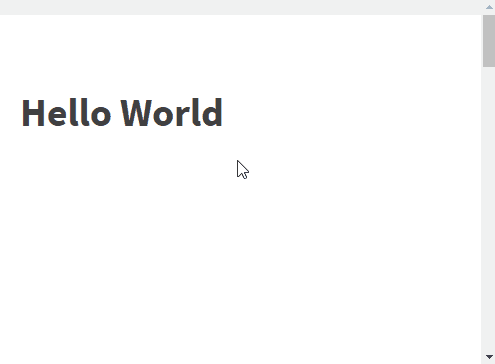

# Scroll Indicator



## Tutorial
1. Oxygen → Templates → Add New Reusable Part  
2. Add title `Scroll Indicator`  
3. Click on ``+Shortcodes`` and insert:
    ```
    [ct_div_block ct_sign_sha256='123' ct_options='{"ct_id":10,"ct_parent":0,"selector":"div_block-10-71","original":{"position":"fixed","top":"0","z-index":"1","width-unit":"%","width":"100","background-color":"#f1f1f1","custom-js":"d2luZG93Lm9uc2Nyb2xsID0gZnVuY3Rpb24oKSB7c2Nyb2xsRnVuYygpfTsKCmZ1bmN0aW9uIHNjcm9sbEZ1bmMoKSB7CiAgdmFyIHdpblNjcm9sbCA9IGRvY3VtZW50LmJvZHkuc2Nyb2xsVG9wIHx8IGRvY3VtZW50LmRvY3VtZW50RWxlbWVudC5zY3JvbGxUb3A7CiAgdmFyIGhlaWdodCA9IGRvY3VtZW50LmRvY3VtZW50RWxlbWVudC5zY3JvbGxIZWlnaHQgLSBkb2N1bWVudC5kb2N1bWVudEVsZW1lbnQuY2xpZW50SGVpZ2h0OwogIHZhciBzY3JvbGxlZCA9ICh3aW5TY3JvbGwgLyBoZWlnaHQpICogMTAwOwogIGRvY3VtZW50LmdldEVsZW1lbnRzQnlDbGFzc05hbWUoInNjcm9sbGJhci1pbmRpY2F0b3ItcHJvZ3Jlc3MiKVswXS5zdHlsZS53aWR0aCA9IHNjcm9sbGVkICsgIiUiOwp9"},"activeselector":false}'][ct_div_block_2 ct_sign_sha256='123' ct_options='{"ct_id":11,"ct_parent":10,"selector":"div_block-11-71","original":{"width-unit":"%","width":"100","height":"10","background-color":"ccc"},"activeselector":false}'][ct_div_block_3 ct_sign_sha256='123' ct_options='{"ct_id":12,"ct_parent":11,"selector":"div_block-12-71","original":{"width-unit":"%","background-color":"#4caf50","width":"0","height":"8","custom-js":""},"activeselector":"scrollbar-indicator-progress","classes":{"0":"scrollbar-indicator-progress"}}'][/ct_div_block_3][/ct_div_block_2][/ct_div_block]
    ```
4. Save
5. Go to your Page, Add → Reusable → `Scroll Indicator`
