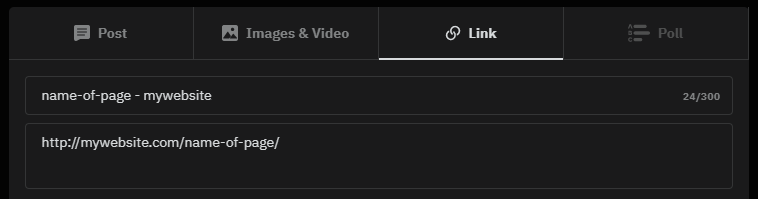

# Social Share Icons
Shares the current page as:  


## Tutorial
1. Oxygen → Templates → Add New Reusable Part  
2. Add title `Social Share Icons`  
3. Click on ``+Shortcodes`` and insert:
    ```
    [ct_div_block ct_sign_sha256='f3ad0d197f4afb02b79f493a882488a302ebd2a49606409bbc9333912ad8fef6' ct_options='{"ct_id":1,"ct_parent":0,"selector":"div_block-19-81","original":{"flex-direction":"row","display":"flex"},"activeselector":false}'][ct_link_2 ct_sign_sha256='47d1f26c3af9d09e1dcbea80b3fd9d45fd45d99ced8872d6c4e13b6e215462f4' ct_options='{"ct_id":2,"ct_parent":1,"selector":"link-21-81","original":{"target":"_blank","url":"https://www.facebook.com/sharer/sharer.php?u=[oxygen ct_sign_sha256='31681eadaebbf657757de479d9cd816f9a96ceb8bc011a2b6551a7a872bf28c6' data='permalink' ]&t=[oxygen ct_sign_sha256='ce0f0946380004f8956be21b5179de757973288856e7765fd3a6b8f009a17b7f' data='phpfunction' function='wp_get_document_title' ]","rel":"noopener noreferrer","url_encoded":"true"},"activeselector":false,"nicename":"Facebook Link Wrapper"}'][ct_fancy_icon ct_sign_sha256='4023777bc9e8e4d846a520f51309f2d824a6d02305acf5df384e6c90d5f4eff9' ct_options='{"ct_id":3,"ct_parent":2,"selector":"fancy_icon-22-81","original":{"icon-id":"FontAwesomeicon-facebook-square"},"activeselector":false,"nicename":"Facebook Icon"}'][/ct_fancy_icon][/ct_link_2][ct_link_2 ct_sign_sha256='ddb22a4f9939b142d35aba131e6ace4872adcb28ea03da5df5219065314168b7' ct_options='{"ct_id":4,"ct_parent":1,"selector":"link-49-81","original":{"target":"_blank","url":"https://twitter.com/intent/tweet?url=[oxygen ct_sign_sha256='31681eadaebbf657757de479d9cd816f9a96ceb8bc011a2b6551a7a872bf28c6' data='permalink' ]&title=[oxygen ct_sign_sha256='ce0f0946380004f8956be21b5179de757973288856e7765fd3a6b8f009a17b7f' data='phpfunction' function='wp_get_document_title' ]","rel":"noopener noreferrer","url_encoded":"true"},"activeselector":false,"nicename":"Twitter Link Wrapper"}'][ct_fancy_icon ct_sign_sha256='0885beea1338c352906bdd1b205aeadf19d32f23136524f5c7bee2af13aeee75' ct_options='{"ct_id":5,"ct_parent":4,"selector":"fancy_icon-50-81","original":{"icon-id":"FontAwesomeicon-twitter-square"},"activeselector":false,"nicename":"Twitter Icon"}'][/ct_fancy_icon][/ct_link_2][ct_link_2 ct_sign_sha256='c334ab22d6b2ca128769fcaef51d0e6304f3864763df12d13d00d7276f20427a' ct_options='{"ct_id":6,"ct_parent":1,"selector":"link-51-81","original":{"target":"_blank","url":"https://www.linkedin.com/shareArticle?mini=true&url=[oxygen ct_sign_sha256='31681eadaebbf657757de479d9cd816f9a96ceb8bc011a2b6551a7a872bf28c6' data='permalink' ]&title=[oxygen ct_sign_sha256='ce0f0946380004f8956be21b5179de757973288856e7765fd3a6b8f009a17b7f' data='phpfunction' function='wp_get_document_title' ]","rel":"noopener noreferrer","url_encoded":"true"},"activeselector":false,"nicename":"LinkedIn Link Wrapper"}'][ct_fancy_icon ct_sign_sha256='f80e5a9f0f7790a93f4ae379da9b4a517445f054870da1cf63769b09c5a8a0c2' ct_options='{"ct_id":7,"ct_parent":6,"selector":"fancy_icon-52-81","original":{"icon-id":"FontAwesomeicon-linkedin-square"},"activeselector":false,"nicename":"LinkedIn Icon"}'][/ct_fancy_icon][/ct_link_2][ct_link_2 ct_sign_sha256='11073cfdeb6e7e61030e09dabe55b0fc117cde671446d3141673ca65f3eca859' ct_options='{"ct_id":8,"ct_parent":1,"selector":"link-53-81","original":{"target":"_blank","url":"mailto:?subject=[oxygen ct_sign_sha256='ce0f0946380004f8956be21b5179de757973288856e7765fd3a6b8f009a17b7f' data='phpfunction' function='wp_get_document_title' ]&body=[oxygen ct_sign_sha256='31681eadaebbf657757de479d9cd816f9a96ceb8bc011a2b6551a7a872bf28c6' data='permalink' ]","rel":"noopener noreferrer","url_encoded":"true"},"activeselector":false,"nicename":"Mail Link Wrapper"}'][ct_fancy_icon ct_sign_sha256='b5e6358eb4e90b30c72d7b8db24b8b50cce8c43147ab3edf63ef85fc01411bc6' ct_options='{"ct_id":9,"ct_parent":8,"selector":"fancy_icon-54-81","original":{"icon-id":"FontAwesomeicon-envelope-square"},"activeselector":false,"nicename":"Mail Icon"}'][/ct_fancy_icon][/ct_link_2][ct_link_2 ct_sign_sha256='341acbea7ea55c5543e3526a1c55010ff50becf7b99bef8e96953f4fe335a655' ct_options='{"ct_id":10,"ct_parent":1,"selector":"link-55-81","original":{"target":"_blank","url":"https://pinterest.com/pin/create/button/?url=[oxygen ct_sign_sha256='31681eadaebbf657757de479d9cd816f9a96ceb8bc011a2b6551a7a872bf28c6' data='permalink' ]&description=[oxygen ct_sign_sha256='ce0f0946380004f8956be21b5179de757973288856e7765fd3a6b8f009a17b7f' data='phpfunction' function='wp_get_document_title' ]","rel":"noopener noreferrer","url_encoded":"true"},"activeselector":false,"nicename":"Pinterest Link Wrapper"}'][ct_fancy_icon ct_sign_sha256='a0512a670132f7d6be7cce382564b67db2402a9645198c6a0f681e9963121fa5' ct_options='{"ct_id":11,"ct_parent":10,"selector":"fancy_icon-56-81","original":{"icon-id":"FontAwesomeicon-pinterest-square"},"activeselector":false,"nicename":"Pinterest Icon"}'][/ct_fancy_icon][/ct_link_2][ct_link_2 ct_sign_sha256='6f1ac8c61a7b52947995e2e1d47ea741bcfa09ea451535a013c83cb1cc9e19bc' ct_options='{"ct_id":12,"ct_parent":1,"selector":"link-57-81","original":{"target":"_blank","url":"https://www.reddit.com/submit?url=[oxygen ct_sign_sha256='31681eadaebbf657757de479d9cd816f9a96ceb8bc011a2b6551a7a872bf28c6' data='permalink' ]&title=[oxygen ct_sign_sha256='ce0f0946380004f8956be21b5179de757973288856e7765fd3a6b8f009a17b7f' data='phpfunction' function='wp_get_document_title' ]","rel":"noopener noreferrer","url_encoded":"true"},"activeselector":false,"nicename":"Reddit Link Wrapper"}'][ct_fancy_icon ct_sign_sha256='3bb48dd912921b8fa133f024e99645956e366c65572333ffd99053d79299bc60' ct_options='{"ct_id":13,"ct_parent":12,"selector":"fancy_icon-58-81","original":{"icon-id":"FontAwesomeicon-reddit-square"},"activeselector":false,"nicename":"Reddit Icon"}'][/ct_fancy_icon][/ct_link_2][/ct_div_block]
    ```
4. Save
5. Go to your Page, Add → Reusable → `Social Share Icons`
